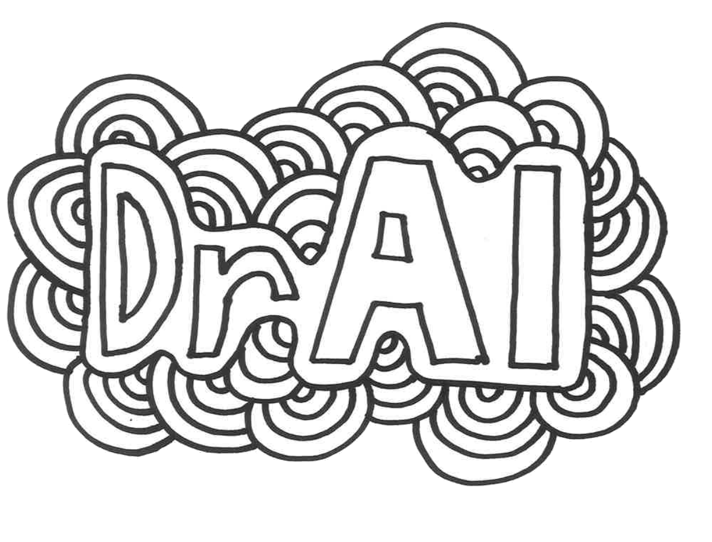
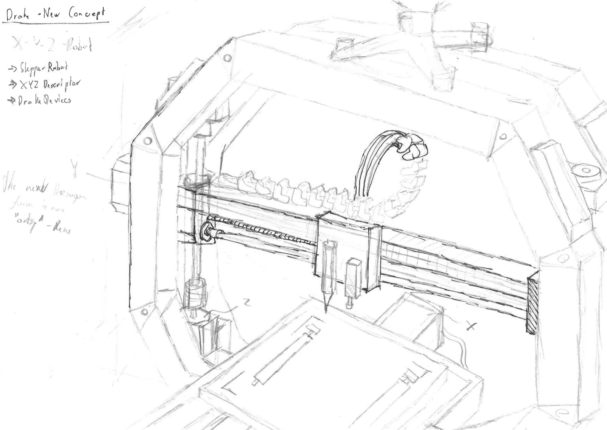
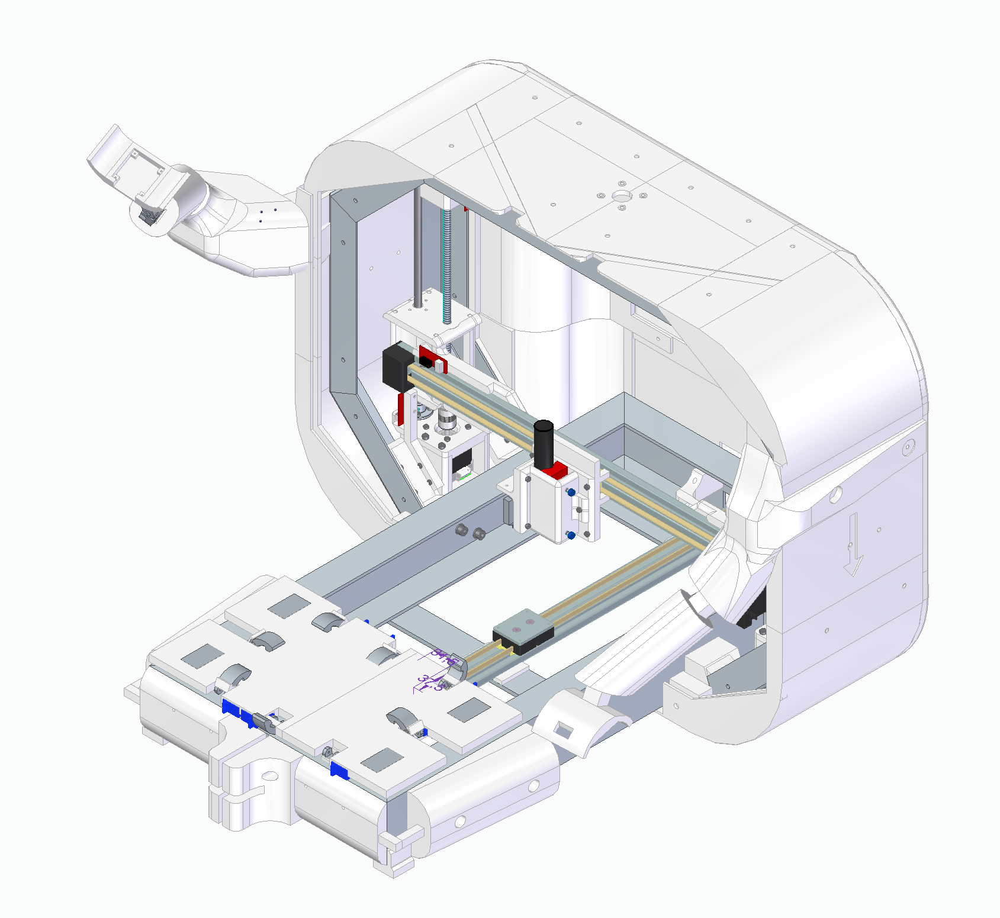
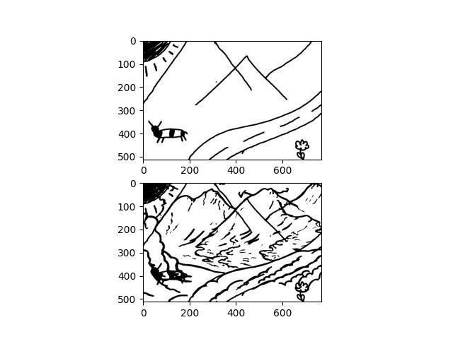
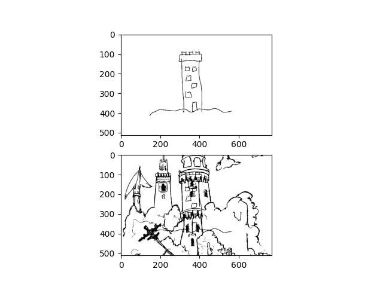

# DrAI

Diploma project estimated in January 2023 in collaboration with [**Ars Electronica Center Linz**](https://ars.electronica.art/) and the [higher secondary vocational college Neufelden](https://htl-neufelden.at).

## Thesis, repo folders and further reading

The thesis is available for everyone to read [here](/documentation/DrAI%20-%20Diplomarbeit.pdf).

All the important folders of this repository contains a *README.md*-file with basic information about the folder itself and important subfolders. As does this folder:

- [code](code/): Code projects for robot control, AI and more 
- [construction](construction/): Parts and drawings for the robot, electronics and other builds
- [documentation](documentation/): Images, graphics, the documentation and the written diploma thesis
- [drake_printer_files](https://github.com/sn-printer-files/drake_printer_files): A subrepository for managing all the *GCODE*-files for the 3D-printed parts of the project
- [electronics](electronics/): Contains all the schematics for the electronics of the project
- [sketches](sketches/): Sketches and basic concept art created for this project, indexed and documentated
- [standard](standard/): Folder with additional standard-parts, will be removed in the future

## Overview

- [DrAI](#drai)
  - [Thesis, repo folders and further reading](#thesis-repo-folders-and-further-reading)
  - [Overview](#overview)
  - [Summary](#summary)
    - [Goal](#goal)
    - [Task](#task)
      - [Software](#software)
      - [Robot](#robot)
  - [Construction](#construction)
  - [AI](#ai)
  - [Electronics](#electronics)

## Summary

### Goal

The goal of this project is to demonstrate the capabilities of AI in completing "creative" tasks in collaboration with humans.

### Task

The final result will be an interactive robot equipped with an AI trained to interpret pre-drawn sketches from the user and complete them with its own "creativity".  
To start this interaction, the user will have to draw some sketch onto a piece of paper, which then is transported into the robot. Once the sheet is in the robot, its goal is to unwrap its "creative" potentials by drawing additional lines onto the paper of the user. The opportunities are limitless here, the AI can for example create a forest next to a cottage the user has drawn onto the sheet, or a beach to some water and so on.

The project can be split up into the two main parts AI (or in general software) and the robot (hardware).

#### Software

First the software has to locate the sheet with a digital camera mounted to the tool and take a picture of it. Then all the lines drawn by the user are detected and interpreted. The fewer lines made by the user, the more "creative" the AI can be. All the merged lines generated are then transfered to the robot.

The software first puts the picture taken into a vision-transformer that creates a description for it, which is then used by a Stable Diffusion Algorithm to generate a colored RGB-image. Out of this images, another algorithm extracts the edges and merges them with the original image.

The robot os is made in rust and allows basic movements required to draw the lines. (See [sybot](https://github.com/SamuelNoesslboeck/sybot))

#### Robot

The robot has to, as already mentioned, be able to draw lines on an A5 sheet of paper. To do this, it will be equipped with a printer tool and three dynamic (X, Y, Z) axes that it can move to any exact position in range it desires.

The user interface should be as simple as possible, not more then two buttons even.

## [Construction](./construction/)

The construction is similar to the one of a 3D-Printer including three stepper-motor controlled linear axis, a BLTouch and endswitches to measure home position and more. A welded aluminum frame is the basis for the robot and with the vast majority of the other parts being 3D-printed, the manufactoring process turned out to be quite simple.

## AI

## Electronics

The electronics consist of the main robot driver and the additional control systems, with the main driver being equipped with multiple high-power stepper motor controllers, as we do not want the user to wait more than five minutes for their picture.

- [Driver README](./electronics/drake_electronics/README.md)