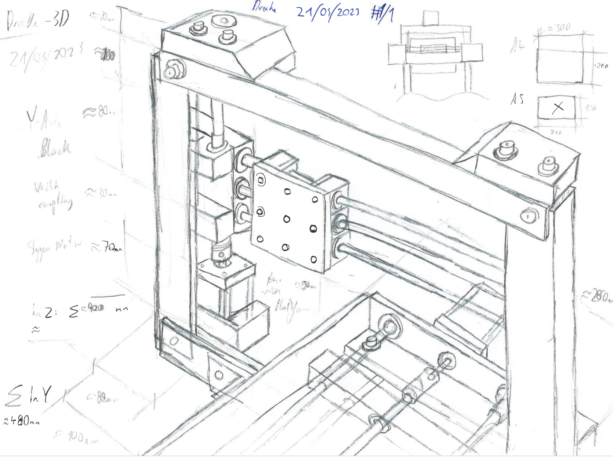

# DrAI

Diplomprojekt erstellt im Januar 2023

Autoren: **Rene Schwarz**, **Samuel Nösslböck**  
Partner: **Ars Electronica Center Linz**

## Übersicht

- [DrAI](#drai)
  - [Übersicht](#übersicht)
  - [Zusammenfassung](#zusammenfassung)
    - [Zielsetzung](#zielsetzung)
    - [Aufgabe](#aufgabe)
      - [Software](#software)
      - [Roboter](#roboter)
  - [Aufbau](#aufbau)
  - [Elektronik](#elektronik)

## Zusammenfassung

### Zielsetzung

Ziel dieses Projekts ist es, die Fähigkeiten von KI bei der Erledigung "kreativer" Aufgaben in Zusammenarbeit mit Menschen zu demonstrieren.

### Aufgabe

Das Endergebnis wird ein interaktiver Roboter sein, der mit einer KI ausgestattet ist, die darauf trainiert ist, vorgezeichnete Skizzen des Benutzers zu interpretieren und sie mit ihrer eigenen "Kreativität" zu vervollständigen.  
Um diesen Prozess zu starten, muss der Benutzer eine Skizze auf ein Blatt Papier zeichnen, das dann in den Roboter transportiert wird. Sobald sich das Blatt im Roboter befindet, ist es sein Ziel, sein Potenzial zu entfalten, indem er zusätzliche Linien auf das Papier des Benutzers zeichnet. Die Möglichkeiten sind hier grenzenlos, die KI kann z. B. einen Wald neben einem Häuschen erschaffen, oder einen Strand neben ein Meer und so weiter.

Das Projekt lässt sich in die beiden Hauptteile KI (oder allgemeiner Software) und Roboter (Hardware) aufteilen.

#### Software

Zunächst muss die Software das Blatt mit einer am Gerät montierten Digitalkamera lokalisieren und ein Foto davon machen. Dann werden alle vom Benutzer gezeichneten Linien erkannt und interpretiert. Je weniger Linien der Benutzer gezeichnet hat, desto "kreativer" kann die KI sein. Alle erzeugten, zusammengefügten Linien werden dann an den Roboter übertragen.

Die Software gibt das aufgenommene Bild zunächst in einen Vision-Transformer, der eine Beschreibung dafür erstellt, die dann von einem "stable diffusion" verwendet wird, um ein farbiges RGB-Bild zu erzeugen. Aus diesem Bild extrahiert ein weiterer Algorithmus die Kanten und fügt sie mit dem Originalbild zusammen.

Das Roboter-OS ist in Rust, einer eher neuen allerdings ziemlich fortgeschrittenen Systemsprache, geschrieben und ermöglicht die grundlegenden Bewegungen, die zum Zeichnen der Linien erforderlich sind. (Siehe [sybot](https://github.com/SamuelNoesslboeck/sybot))

#### Roboter

Der Roboter muss, wie bereits erwähnt, in der Lage sein, Linien auf ein A5-Blatt Papier zu zeichnen. Dazu wird er mit einem Zeichenwerkzeug und drei dynamischen Achsen (X, Y, Z) ausgestattet sein, die er in dem Bereich des Papieres exakt anfahren kann.

Die Benutzeroberfläche sollte so einfach wie möglich sein, nicht mehr als zwei Tasten sogar.

## Aufbau

Der Aufbau ähnelt dem eines 3D-Druckers mit drei schrittmotorgesteuerten Linearachsen, einem BLTouch und Endschaltern zur Messung der Ausgangsposition und mehr.

## Elektronik

Die Elektronik besteht aus dem Hauptrobotertreiber und den zusätzlichen Steuersystemen.

[Treiber README](./electronics/drake_electronics/README.md)
