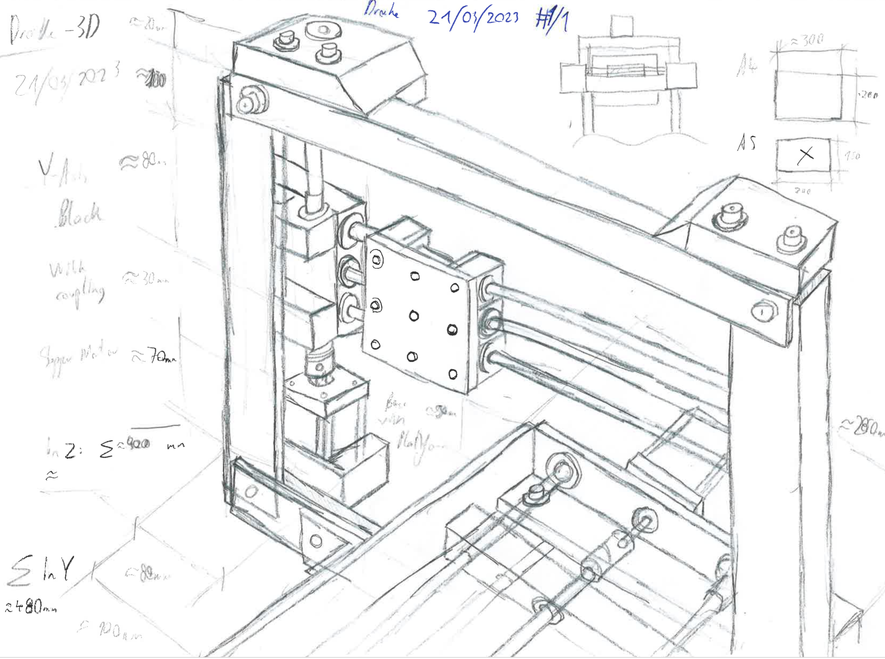

# DrAI

Diploma project created in January 2023

Authors: 
  [**Rene Schwarz**](https://github.com/SchwarzRene), 
  [**Samuel Nösslböck**](https://github.com/SamuelNoesslboeck)  
Partner: [**Ars Electronica Center Linz**](https://ars.electronica.art/news/en/)

## Overview

- [DrAI](#drai)
  - [Overview](#overview)
  - [Summary](#summary)
    - [Goal](#goal)
    - [Task](#task)
      - [Software](#software)
      - [Robot](#robot)
  - [General information](#general-information)
  - [Construction](#construction)
    - [Naming system](#naming-system)
    - [About subassemblies](#about-subassemblies)

## Summary

### Goal

We want to demonstrate the capabilities of AI in completing "creative" tasks in collaboration with humans.

### Task

The final result will be an interactive robot equipped with an AI trained to interpret pre-drawn sketches from the user and complete them with its own "creativity".  
To start this interaction, the user will have to draw some sketch onto a piece of paper, which then is transported into the robot. Once the sheet is in the robot, its goal is to unwrap its "creative" potentials by drawing additional lines onto the paper of the user. The opportunities are limitless here, the AI can for example create a forest next to a cottage the user has drawn onto the sheet, or a beach to some water and so on.

The project can be split up into the two main parts AI (or in general software) and the robot (hardware).

#### Software

First the software has to locate the sheet with a digital camera mounted to the tool and take a picture of it. Then all the lines drawn by the user are detected and interpreted. The fewer lines made by the user, the more "creative" the AI can be. All the merged lines generated are then transfered to the robot.

The software first puts the picture taken into a vision-transformer that creates a description for it, which is then used by a Stable Diffusion Algorithm to generate a colored RGB-image. Out of this images, another algorithm extracts the edges and merges them with the original image. 

The robot os is made in rust and allows basic movements required to draw the lines. (See [sybot_lib](https://github.com/SamuelNoesslboeck/sybot_lib))

#### Robot

The robot has to, as already mentioned, be able to draw lines on an A5 sheet of paper. To do this, it will be equipped with a printer tool and three dynamic axes that it can move to any exact position in range it desires.

The user interface should be as simple as possible, not more then two buttons even.

## General information

## Construction

### Naming system

In order to keep the project clean, the filesystem for the construction has a strict naming scheme. 

- Assemblies are referenced with an "a" prefix. Depending on the type of assembly a number can be added:
  - The main assembly has no number (e.g. "a_drake")
  - Subassemblies have a number attached to them (e.g. "a1_frame")
  - There can be subassemblies of subassemblies (e.g. "a1.1_frame_base")
- Standard parts have an "n{part-number}_" prefix
  - They are placed in a "standard" directory
- Modified parts (standard parts with modifications) have an "m{part-number}_" prefix
  - They are placed in a "modified" directory
- Custom parts just have their part number as prefix "{part-number}_"
  - They are placed into the assembies root

### About subassemblies

The important rule about subassemblies is, that they should always work on their own. This can of course mean that standard parts can be found multiple times in a construction.